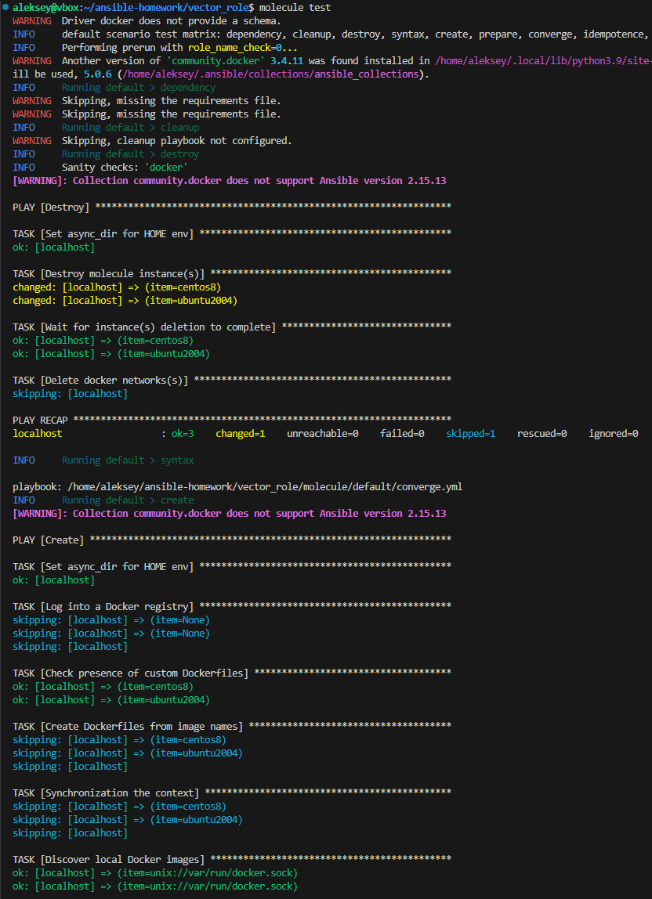
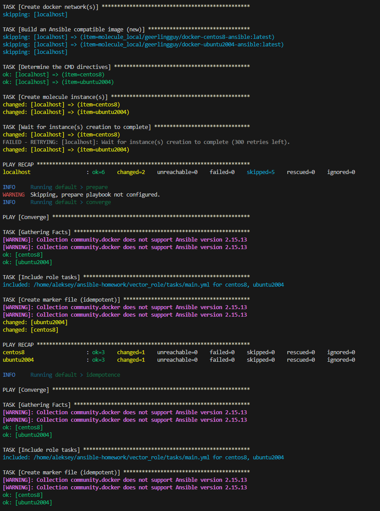
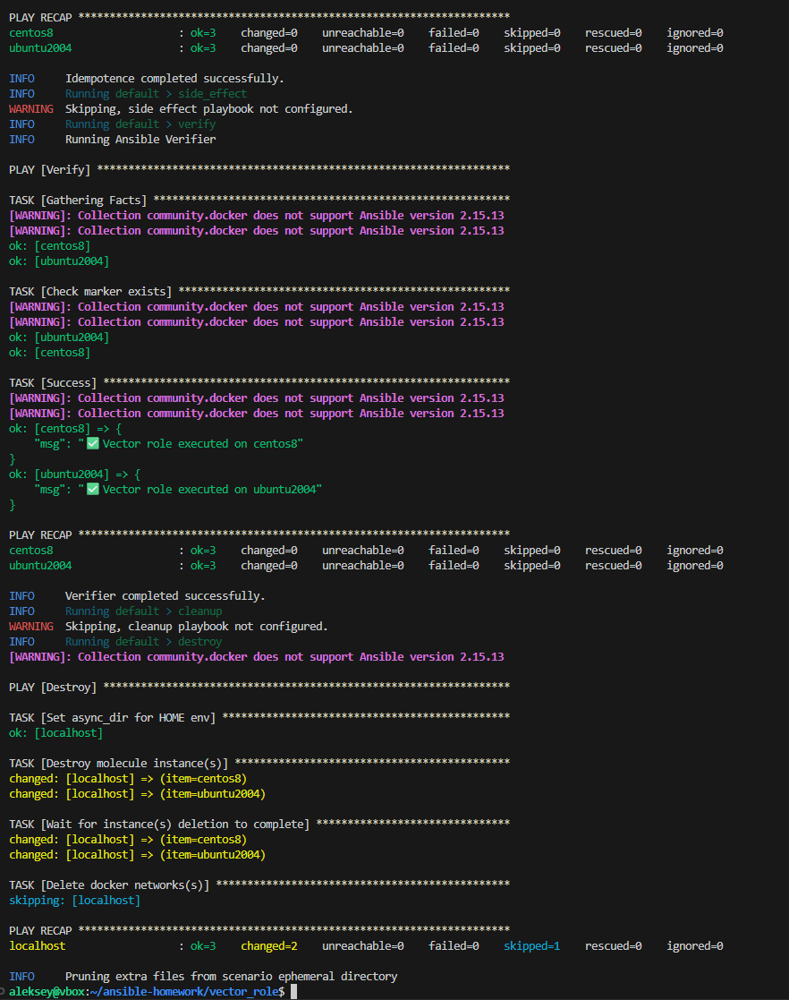
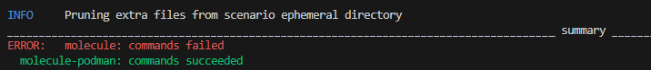

# Vector Role

Устанавливает и настраивает [Vector](https://vector.dev) — агент для сбора и отправки логов в ClickHouse.

## Требования

- Ubuntu 22.04 (Jammy) или 24.04 (Noble)
- Доступ к интернету для загрузки пакетов

## Переменные

| Переменная | Описание | По умолчанию |
|------------|----------|--------------|
| `clickhouse_host` | Адрес сервера ClickHouse | `localhost` |
| `clickhouse_port` | HTTP-порт ClickHouse | `8123` |
| `clickhouse_database` | БД для хранения логов | `logs` |
| `clickhouse_table` | Таблица для логов | `vector_logs` |
| `vector_include_containers` | Контейнеры для сбора логов | `["clickhouse-server"]` |

## Пример использования

```yaml
- hosts: clickhouse_servers
  roles:
    - role: vector-role
      vars:
        clickhouse_host: "10.0.0.5"
        clickhouse_database: "production_logs"
        vector_include_containers:
          - "clickhouse-server"
          - "nginx"
```


# Тестирование:
## Molecule







## Tox



Сценарий default использует драйвер docker и требует доступа к Docker socket. В изолированном окружении tox внутри Docker-контейнера доступ к сокету ограничен. Сценарий podman работает корректно.